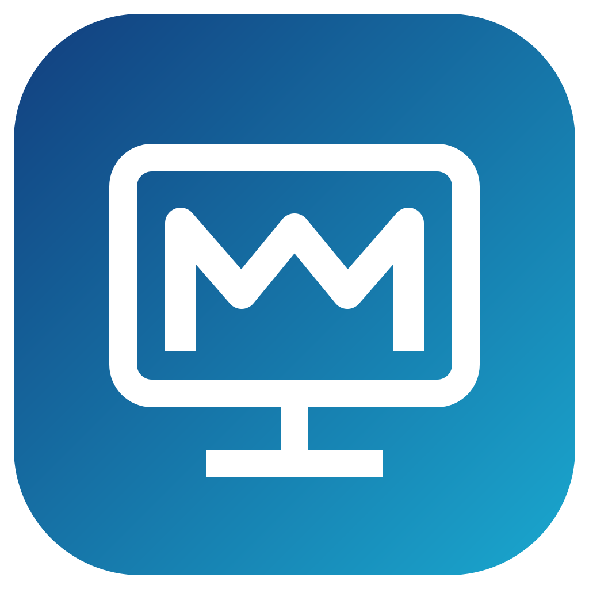

<p align="center">
  
</p>

# MirvDesk Client

MirvDesk is a self-hosted remote desktop system built as an independent downstream of [RustDesk](https://github.com/rustdesk/rustdesk). The client stays close to upstream RustDesk for the remote-control engine and user interface while adding MirvDesk server discovery, accounts, personal address books, device groups, independent application identity and packaging.

MirvDesk is not affiliated with or endorsed by RustDesk/Purslane.

## What MirvDesk adds

- a separate **MirvDesk** application identity, configuration, services and URI scheme, so MirvDesk and RustDesk can be installed on the same machine;
- mandatory self-hosted server bootstrap: a build is tied only to the server URL chosen by the person compiling it;
- MirvDesk account login and personal address-book synchronization;
- **Accessible devices / Groups** with server-side user and device-group permissions;
- a distinct teal/cyan MirvDesk visual palette and application icons;
- native packages for Windows, Linux, macOS and Android;
- CI separated into fast push checks, full cross-platform validation and release builds.

## You need your own server

MirvDesk deliberately has **no public/default server**. This repository contains the client; the companion backend is [mirivlad/mirvdesk-server](https://github.com/mirivlad/mirvdesk-server).

Deploy your own MirvDesk Server first. The usual public ports are:

| Port | Protocol | Purpose |
|---|---|---|
| 21115 | TCP | NAT type / rendezvous support |
| 21116 | TCP + UDP | ID / rendezvous |
| 21117 | TCP | relay |
| 21114 | HTTP behind HTTPS reverse proxy | MirvDesk API and discovery |

See the server repository for the recommended Docker/Portainer + nginx deployment.

## Mandatory build variable

Every MirvDesk client build must define `MIRVDESK_SERVER_URL` with the public base URL of **your own** server, for example:

```text
https://desk.example.com
```

There is no fallback value. A missing, empty, malformed, or credential-bearing value fails the build intentionally.

For a GitHub Actions build in your fork, create the repository variable:

**Settings → Secrets and variables → Actions → Variables → `MIRVDESK_SERVER_URL`**

For a local build:

```bash
export MIRVDESK_SERVER_URL="https://desk.example.com"
```

The URL is not a secret: it is embedded into the client binary. Never put passwords, tokens or user information in it.

On first launch MirvDesk requests:

```text
https://desk.example.com/.well-known/mirvdesk
```

and discovers the ID server, relay server, API URL, public key and server capabilities. Release CI verifies that Linux packages actually contain the configured bootstrap URL before publication.

More detail: [docs/MIRVDESK_SELF_HOST_BUILD.md](docs/MIRVDESK_SELF_HOST_BUILD.md).

## Groups and users

MirvDesk 1.6 introduces the RustDesk-compatible **Accessible devices / Groups** view.

The server records a device when its owner logs in. Server administrators can create regular users, create device groups, assign devices to groups and grant users access to those groups using `mirvdesk-admin`. The client then shows only the devices accessible to the logged-in account; server administrators can see all registered devices.

Example server-side administration:

```bash
docker exec -it mirvdesk-server mirvdesk-admin create-user
docker exec -it mirvdesk-server mirvdesk-admin group-create Operations
docker exec -it mirvdesk-server mirvdesk-admin devices
docker exec -it mirvdesk-server mirvdesk-admin device-group 123456789 Operations
docker exec -it mirvdesk-server mirvdesk-admin group-add-user Operations alice
```

Personal Address Book remains separate from Groups and continues to sync per account.

## Coexisting with RustDesk

MirvDesk intentionally uses its own external identity:

- application/config namespace: `MirvDesk`;
- Linux command/service/install paths: `mirvdesk`, `mirvdesk.service`, `/usr/share/mirvdesk`;
- mobile bundle/application IDs: `top.mirv.mirvdesk`;
- URI scheme: `mirvdesk://`;
- separate Windows service/runtime names and macOS transient state.

Some internal crate, ABI and native-library names still contain `rustdesk`. Those are upstream implementation details and are deliberately retained where renaming would create needless merge and compatibility risk; they do not make MirvDesk share user configuration with RustDesk.

## Building

The supported reproducible build path is GitHub Actions. After defining `MIRVDESK_SERVER_URL`, normal pushes run only the fast validation suite. Full cross-platform builds are available manually, nightly, or through `ci/full/**` branches. Version tags run the release pipeline and publish packages.

See [docs/CI.md](docs/CI.md) for the CI layout and [docs/MIRVDESK_SELF_HOST_BUILD.md](docs/MIRVDESK_SELF_HOST_BUILD.md) for self-host build requirements.

For lower-level platform dependencies and RustDesk internals, refer to the [upstream RustDesk build documentation](https://rustdesk.com/docs/en/dev/build/). MirvDesk keeps the upstream source layout closely enough that those prerequisites remain useful, but the MirvDesk bootstrap variable is additionally mandatory.

## Current status

Implemented:

- remote desktop, file transfer, TCP tunneling and the main RustDesk feature set inherited from upstream;
- independent MirvDesk branding/configuration/packaging;
- runtime discovery from a self-hosted MirvDesk Server;
- account authentication;
- personal address-book synchronization;
- Accessible devices / Groups;
- Windows, Linux, macOS and Android release builds.

Not yet implemented in the MirvDesk backend:

- shared address books/profiles beyond the personal address book;
- a MirvDesk-specific automatic update channel. The stock RustDesk updater is intentionally disabled so MirvDesk cannot replace itself with an upstream RustDesk build.

## Repositories

- Client: https://github.com/mirivlad/mirvdesk-client
- Server: https://github.com/mirivlad/mirvdesk-server
- Upstream client: https://github.com/rustdesk/rustdesk

## License and attribution

MirvDesk is distributed under **AGPL-3.0**. See [LICENSE](LICENSE) and [THIRD_PARTY.md](THIRD_PARTY.md).

RustDesk is developed by the RustDesk project/Purslane and is also distributed under AGPL-3.0. MirvDesk is an independent downstream project and preserves upstream copyright and license notices where required.
